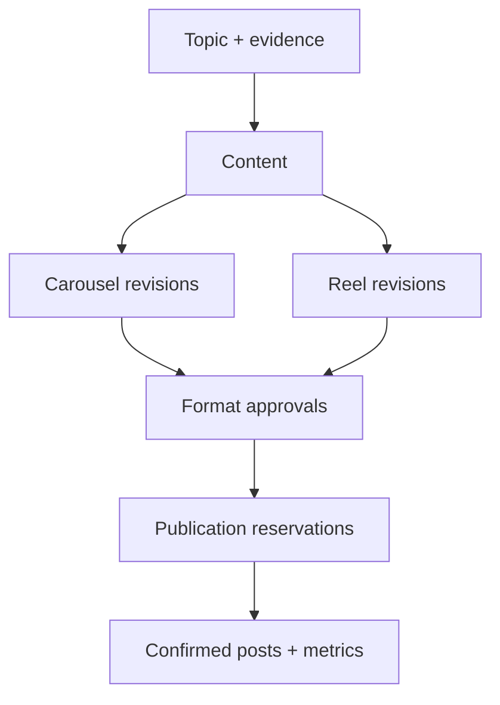

# Information architecture

Desktop primary: Home · Discover · Content · Review · Activity · Analytics · Settings. Discover contains Latest, Saved, Editorial queue, topic details and source review. Content contains format-specific editors, previews, captions, versions, publications, calendar, archive and trash. Review presents independent format decisions. Activity contains jobs and notifications. Settings contains Profile, Workspace, Research, Providers, Instagram, Notifications, Security, Data/privacy and Help.

iOS primary: Home · Discover · Content · Activity · Settings. Content segmented destinations: Library, Review, Calendar. Analytics has a Home shortcut and Settings entry. Notifications open from the header bell. No hidden hamburger copies of the full sidebar. Create is a contextual button, never a navigation tab. A content item groups Carousel and Reel outputs without flattening their approval, asset or publishing states.

Entity hierarchy: workspace → topic → source snapshots/claims → creation setup → content → output(carousel/reel) → revisions/assets → approval snapshot → publication reservation → job/attempt → analytics snapshot. A topic can have related versions/content angles in the future; the existing canonical URL uniqueness is preserved until explicit policy migration. Proposed Duplicate does not bypass originality checks or automatically authorize another publish.

Discover→Researchhistory(DISC-02)→Runfindings(DISC-01?run=:runId)orCoverage sheet→Retryfailedsources(Activityjob).
