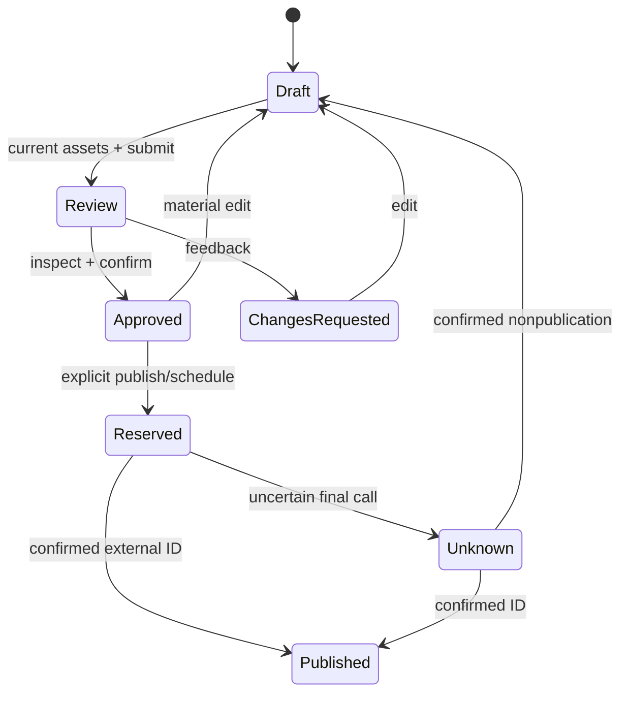

# State transitions and invariants

Legacy post: draft/rejected → submit → pending_review → approve → approved. pending_review → reject → rejected. Any edit/artwork enqueue → draft + increment version + clear validation/approval eligibility. approved → publish reservation → publishing → published OR needs_reconciliation job while post remains publishing. Confirmed not-published reconciliation → draft; published reconciliation needs external ID. Post edit blocked during active jobs and publishing/published.

Proposed output editorial status is draft / pending_review / changes_requested / approved / published. Generation is a separate operational stage (queued/running/partial/failed/completed), not an editorial status. 'Ready to submit' means draft + all eligibility checks pass. 'Ready for review' labels pending_review after explicit Submit; it does not mean merely that generation finished. draft → pending_review on valid submit; pending_review → approved or changes_requested. Changes requested return draft on first edit, with feedback retained until resolved. Approved material edit → draft. Publication status belongs to a reservation; approved output can have executing/unknown reservation without altering immutable working status. Published output/snapshot is immutable; new changes require duplicate draft. Shared evidence changes invalidate dependent approvals and block affected future reservations; unrelated frozen media/caption schedules remain frozen when only working copy changes. Pure mute/filter/selection never alters approval. Internal title metadata only invalidates when used in asset/hash; legacy stricter behavior remains until migration.

Proposed publication reservation: scheduled → blocked OR executing → confirmed_published OR confirmed_failed OR unknown. scheduled → cancelled only before claim. blocked → scheduled only after explicit corrected reauthorization. unknown → confirmed_published with ID, or confirmed_not_published then output draft; unknown never directly retry. An already authorized frozen scheduled snapshot remains valid when working draft changes; UI states “Scheduled v12 · editing v13” and offers Update schedule after reapproval.

Job: queued → running → completed/completed_with_warnings OR retry_wait OR failed. retry_wait → running; retry limit exhausted → failed. Lease expiry normal nonpublishing → reclaimed running; publishing expiry → outcome check/reconciliation. Proposed queued → cancelled; running → cancelling → cancelled/completed-if-finished-first. stalled is detected operational flag over running, not invented status from network timeout. Failure has canRetry/correctionReason; no universal retry. Worker health and unit counts come from server.

Reel milestones: script_ready → storyboard_ready → visual_assets_ready → audio_ready (or explicit silent) → rendering → mp4_rendered → mp4_validated → ready_for_review. Editing a dependency marks dependent artifacts stale. Only valid current render can submit. Old render remains available with its own immutable revision; no false latest label.

All transitions atomically check revision, access, asset/evidence hashes, active reservation and state; rejected races return authoritative state. Notifications are emitted after commit, once per event. No client-only approval flag is trusted.
