# Workflow decision maps

These branch maps supplement journeys.md and state transitions. Each action follows the linked interaction,permission,revision,persistence and notification rules.

## A — Discover
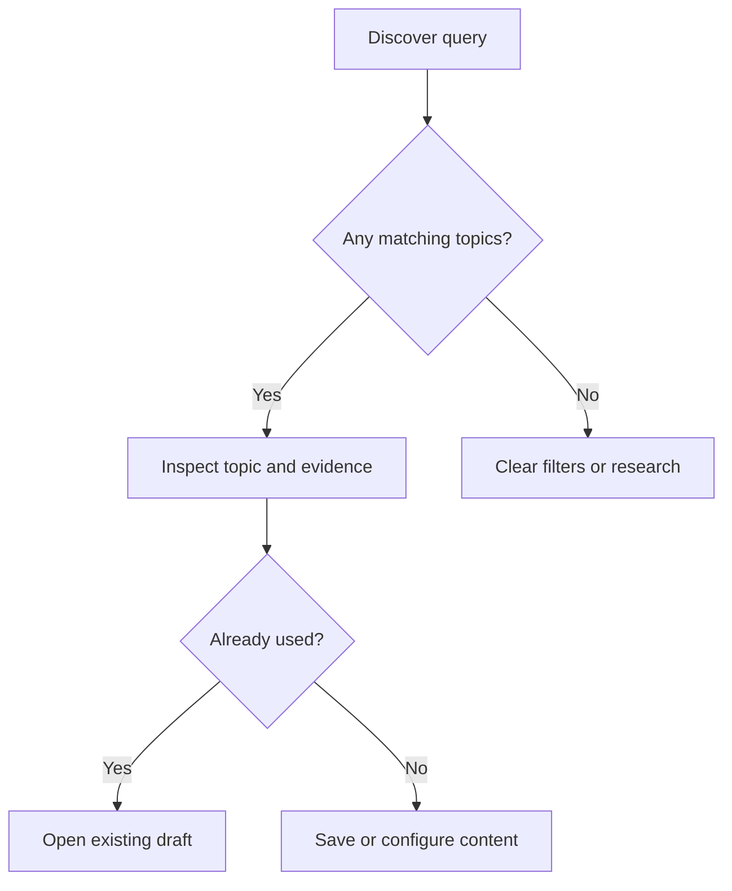
```mermaid
flowchart TD
 A["Discover query"] --> B{"Any matching topics?"}
 B -->|Yes| C["Inspect topic and evidence"]
 B -->|No| D["Clear filters or research"]
 C --> E{"Already used?"}
 E -->|Yes| F["Open existing draft"]
 E -->|No| G["Save or configure content"]
```

## B — Daily research
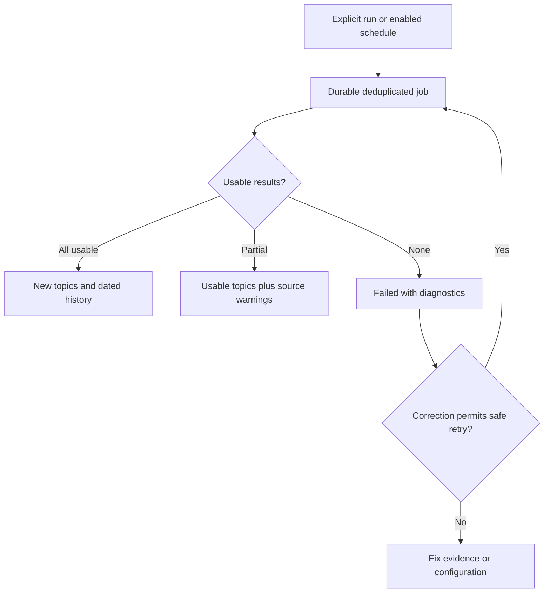
```mermaid
flowchart TD
 A["Explicit run or enabled schedule"] --> B["Durable deduplicated job"]
 B --> C{"Usable results?"}
 C -->|All usable| D["New topics and dated history"]
 C -->|Partial| E["Usable topics plus source warnings"]
 C -->|None| F["Failed with diagnostics"]
 F --> G{"Correction permits safe retry?"}
 G -->|Yes| B
 G -->|No| H["Fix evidence or configuration"]
```

## C — Verify
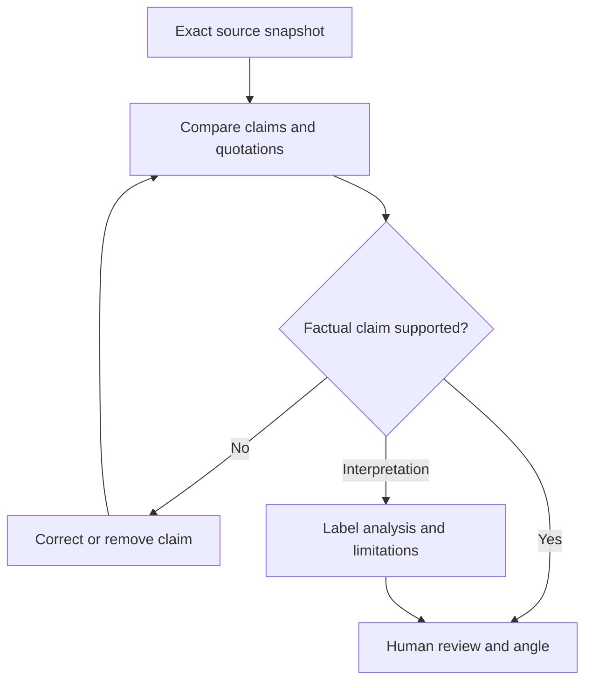
```mermaid
flowchart TD
 A["Exact source snapshot"] --> B["Compare claims and quotations"]
 B --> C{"Factual claim supported?"}
 C -->|Yes| D["Human review and angle"]
 C -->|No| E["Correct or remove claim"]
 E --> B
 C -->|Interpretation| F["Label analysis and limitations"]
 F --> D
```

## D — Configure
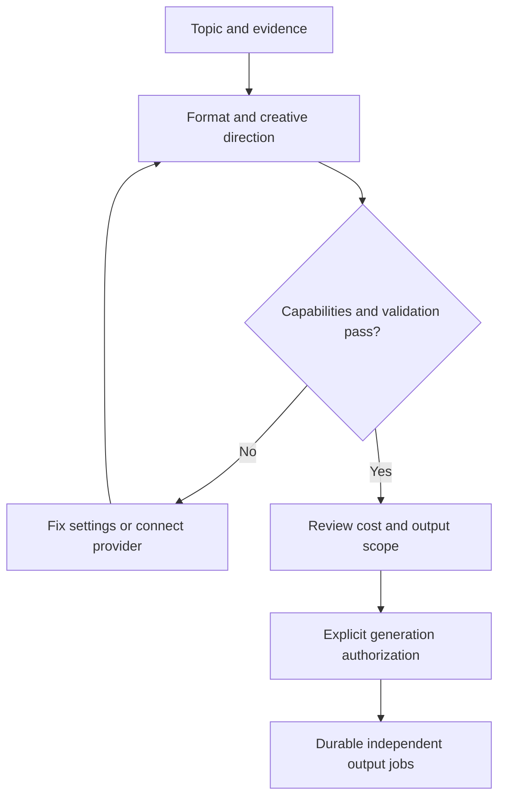
```mermaid
flowchart TD
 A["Topic and evidence"] --> B["Format and creative direction"]
 B --> C{"Capabilities and validation pass?"}
 C -->|No| D["Fix settings or connect provider"]
 D --> B
 C -->|Yes| E["Review cost and output scope"]
 E --> F["Explicit generation authorization"]
 F --> G["Durable independent output jobs"]
```

## E — Carousel generation
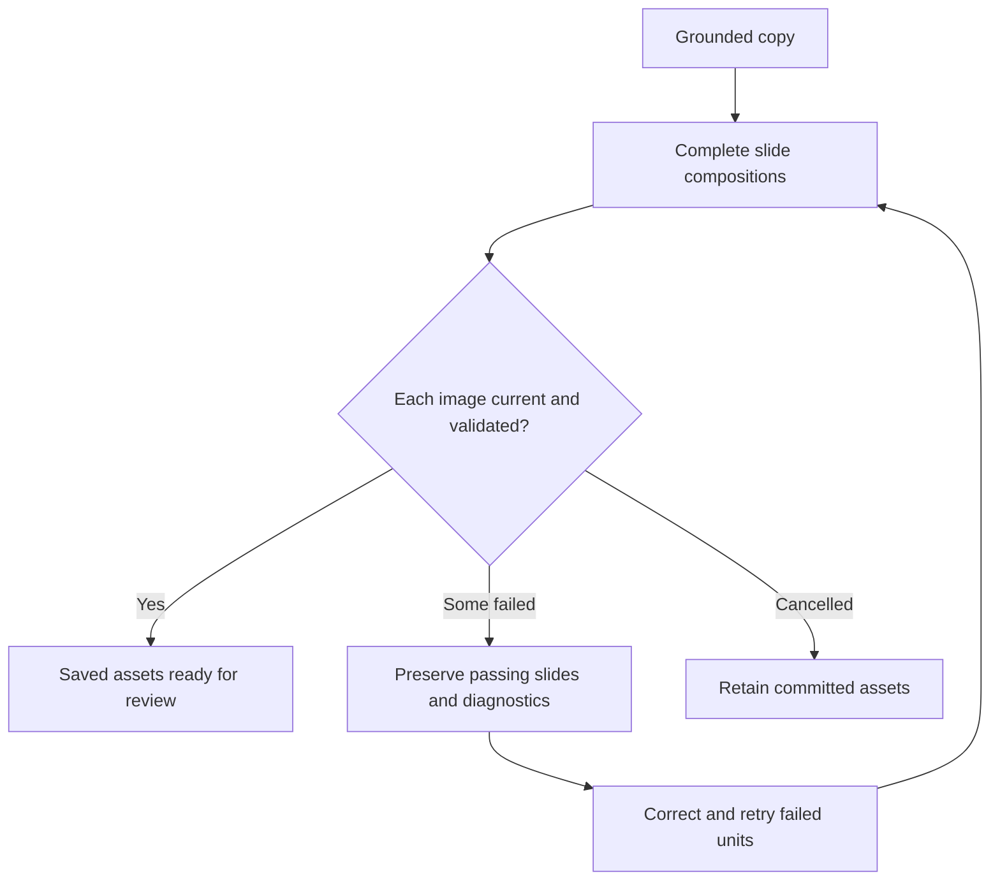
```mermaid
flowchart TD
 A["Grounded copy"] --> B["Complete slide compositions"]
 B --> C{"Each image current and validated?"}
 C -->|Yes| D["Saved assets ready for review"]
 C -->|Some failed| E["Preserve passing slides and diagnostics"]
 E --> F["Correct and retry failed units"]
 F --> B
 C -->|Cancelled| G["Retain committed assets"]
```

## F — Carousel editing
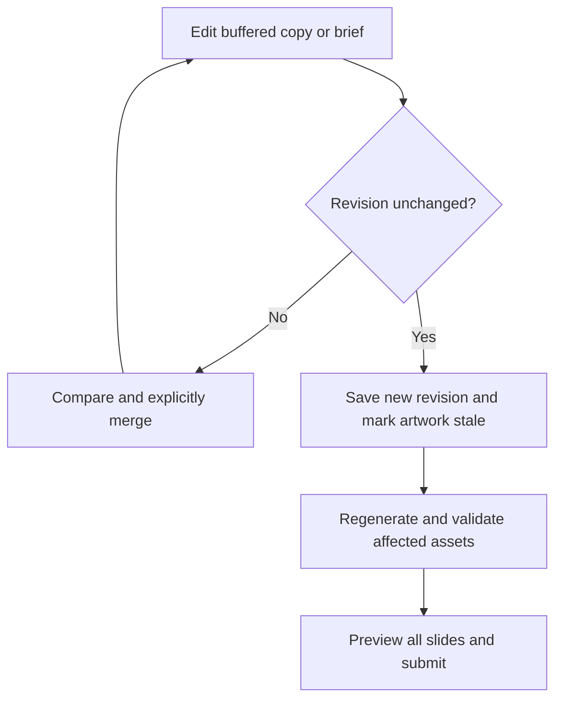
```mermaid
flowchart TD
 A["Edit buffered copy or brief"] --> B{"Revision unchanged?"}
 B -->|No| C["Compare and explicitly merge"]
 C --> A
 B -->|Yes| D["Save new revision and mark artwork stale"]
 D --> E["Regenerate and validate affected assets"]
 E --> F["Preview all slides and submit"]
```

## G — Reel generation
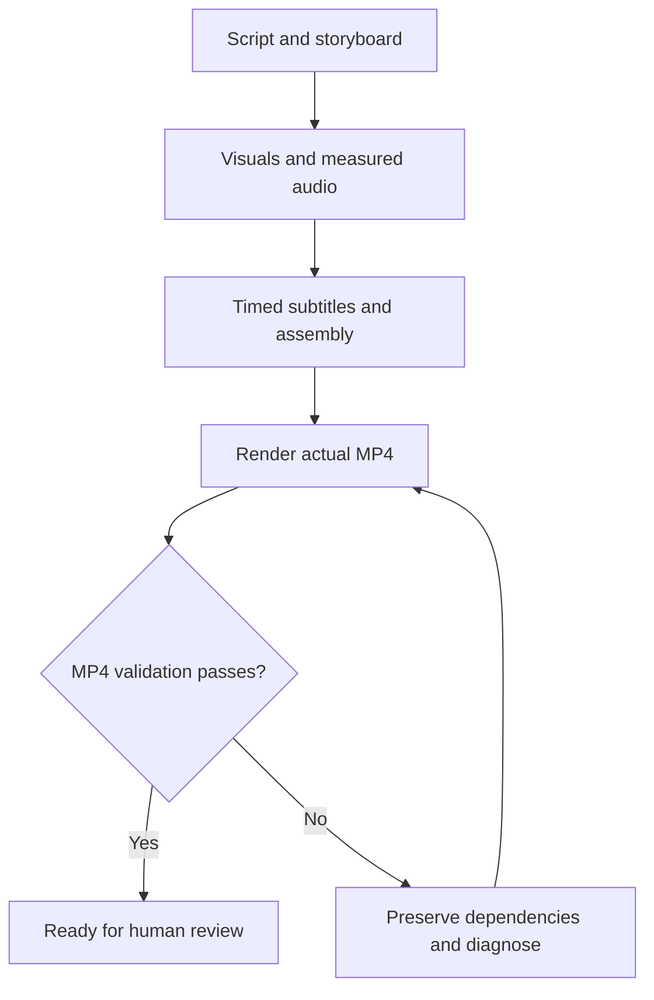
```mermaid
flowchart TD
 A["Script and storyboard"] --> B["Visuals and measured audio"]
 B --> C["Timed subtitles and assembly"]
 C --> D["Render actual MP4"]
 D --> E{"MP4 validation passes?"}
 E -->|Yes| F["Ready for human review"]
 E -->|No| G["Preserve dependencies and diagnose"]
 G --> D
```

## H — Reel editing
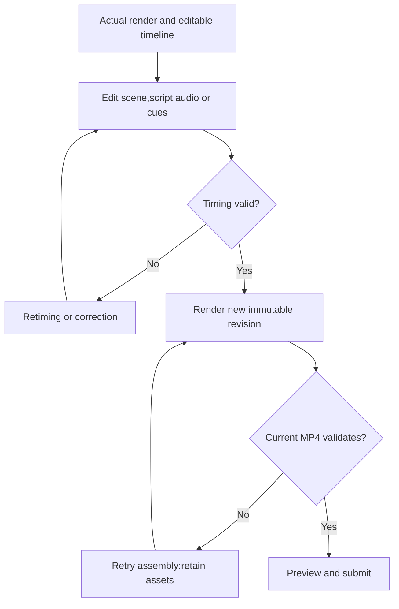
```mermaid
flowchart TD
 A["Actual render and editable timeline"] --> B["Edit scene,script,audio or cues"]
 B --> C{"Timing valid?"}
 C -->|No| D["Retiming or correction"]
 D --> B
 C -->|Yes| E["Render new immutable revision"]
 E --> F{"Current MP4 validates?"}
 F -->|No| G["Retry assembly;retain assets"]
 G --> E
 F -->|Yes| H["Preview and submit"]
```

## I — Review
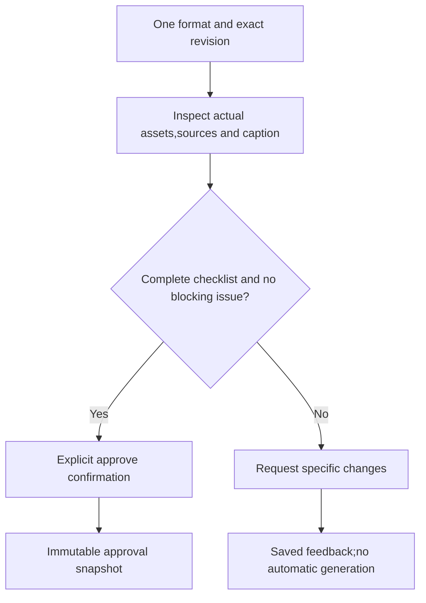
```mermaid
flowchart TD
 A["One format and exact revision"] --> B["Inspect actual assets,sources and caption"]
 B --> C{"Complete checklist and no blocking issue?"}
 C -->|Yes| D["Explicit approve confirmation"]
 D --> E["Immutable approval snapshot"]
 C -->|No| F["Request specific changes"]
 F --> G["Saved feedback;no automatic generation"]
```

## J — Publication
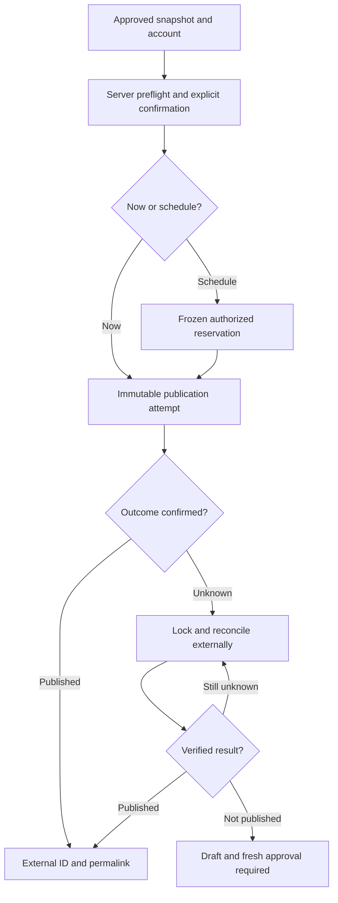
```mermaid
flowchart TD
 A["Approved snapshot and account"] --> B["Server preflight and explicit confirmation"]
 B --> C{"Now or schedule?"}
 C -->|Schedule| D["Frozen authorized reservation"]
 C -->|Now| E["Immutable publication attempt"]
 D --> E
 E --> F{"Outcome confirmed?"}
 F -->|Published| G["External ID and permalink"]
 F -->|Unknown| H["Lock and reconcile externally"]
 H --> I{"Verified result?"}
 I -->|Published| G
 I -->|Not published| K["Draft and fresh approval required"]
 I -->|Still unknown| H
```

## K — Library lifecycle
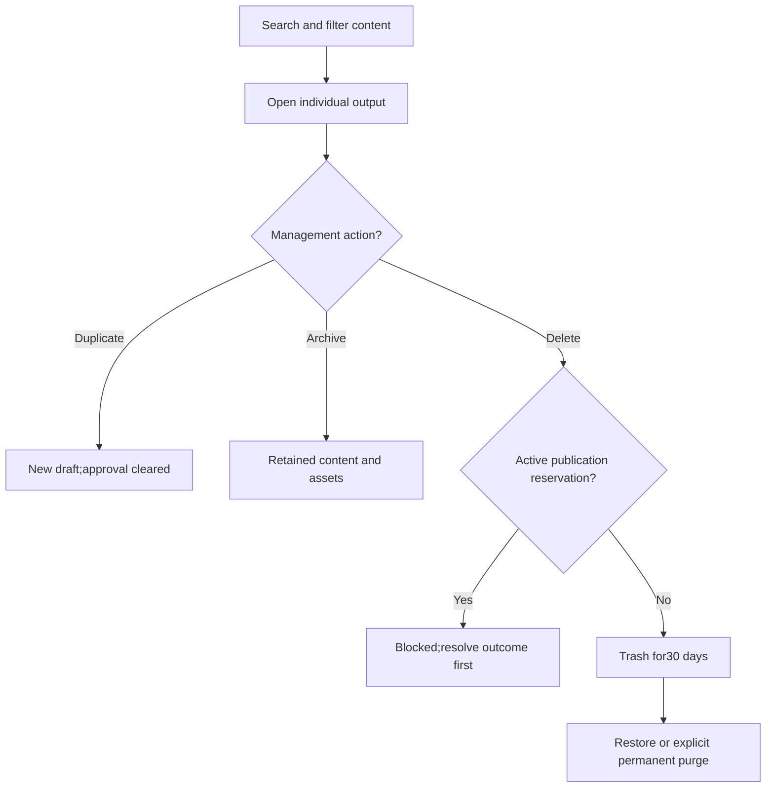
```mermaid
flowchart TD
 A["Search and filter content"] --> B["Open individual output"]
 B --> C{"Management action?"}
 C -->|Duplicate| D["New draft;approval cleared"]
 C -->|Archive| E["Retained content and assets"]
 C -->|Delete| F{"Active publication reservation?"}
 F -->|Yes| G["Blocked;resolve outcome first"]
 F -->|No| H["Trash for30 days"]
 H --> I["Restore or explicit permanent purge"]
```

## L — Activity
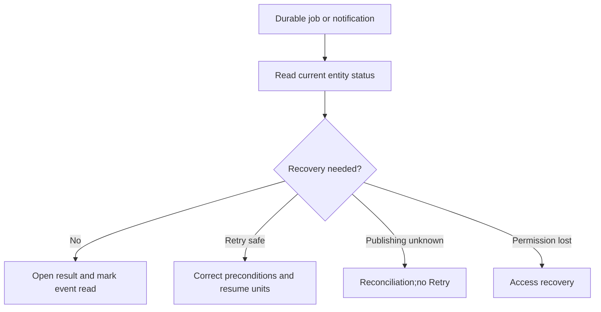
```mermaid
flowchart TD
 A["Durable job or notification"] --> B["Read current entity status"]
 B --> C{"Recovery needed?"}
 C -->|No| D["Open result and mark event read"]
 C -->|Retry safe| E["Correct preconditions and resume units"]
 C -->|Publishing unknown| F["Reconciliation;no Retry"]
 C -->|Permission lost| G["Access recovery"]
```

## M — Analytics
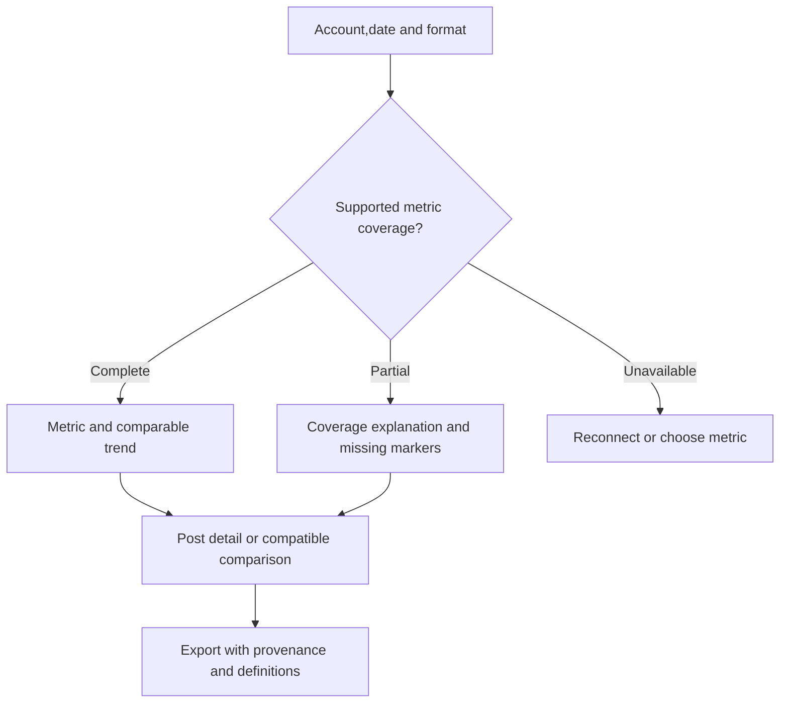
```mermaid
flowchart TD
 A["Account,date and format"] --> B{"Supported metric coverage?"}
 B -->|Complete| C["Metric and comparable trend"]
 B -->|Partial| D["Coverage explanation and missing markers"]
 B -->|Unavailable| E["Reconnect or choose metric"]
 C --> F["Post detail or compatible comparison"]
 D --> F
 F --> G["Export with provenance and definitions"]
```

## N — Integrations
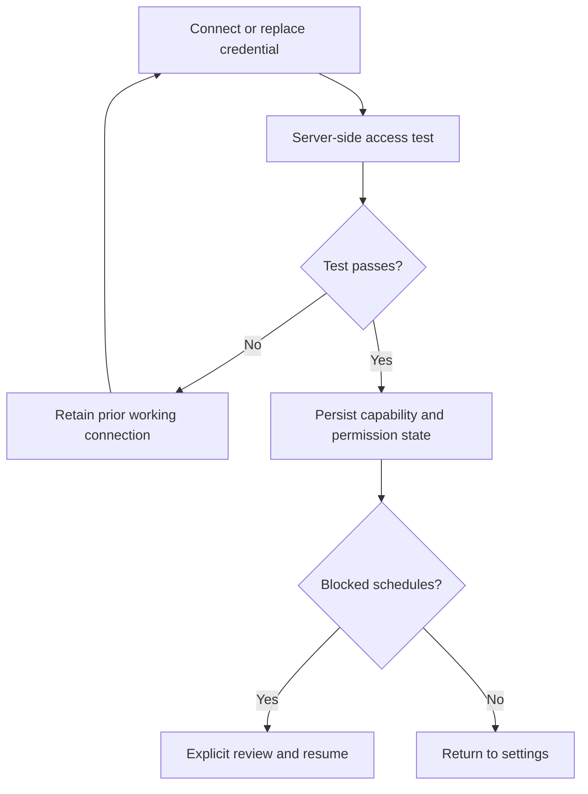
```mermaid
flowchart TD
 A["Connect or replace credential"] --> B["Server-side access test"]
 B --> C{"Test passes?"}
 C -->|No| D["Retain prior working connection"]
 D --> A
 C -->|Yes| E["Persist capability and permission state"]
 E --> F{"Blocked schedules?"}
 F -->|Yes| G["Explicit review and resume"]
 F -->|No| H["Return to settings"]
```

## O — Device continuity
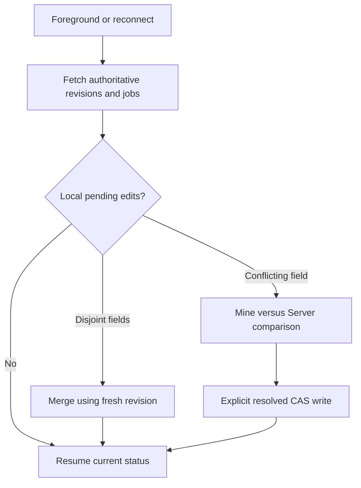
```mermaid
flowchart TD
 A["Foreground or reconnect"] --> B["Fetch authoritative revisions and jobs"]
 B --> C{"Local pending edits?"}
 C -->|No| D["Resume current status"]
 C -->|Disjoint fields| E["Merge using fresh revision"]
 C -->|Conflicting field| F["Mine versus Server comparison"]
 F --> G["Explicit resolved CAS write"]
 E --> D
 G --> D
```

## Authentication
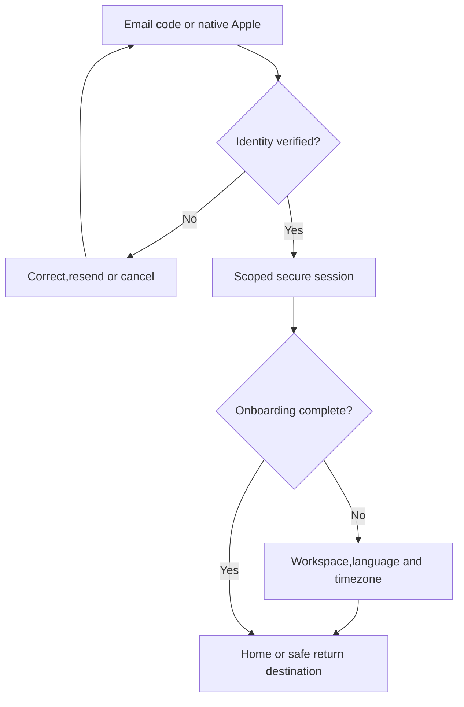
```mermaid
flowchart TD
 A["Email code or native Apple"] --> B{"Identity verified?"}
 B -->|No| C["Correct,resend or cancel"]
 C --> A
 B -->|Yes| D["Scoped secure session"]
 D --> E{"Onboarding complete?"}
 E -->|No| F["Workspace,language and timezone"]
 F --> G["Home or safe return destination"]
 E -->|Yes| G
```
